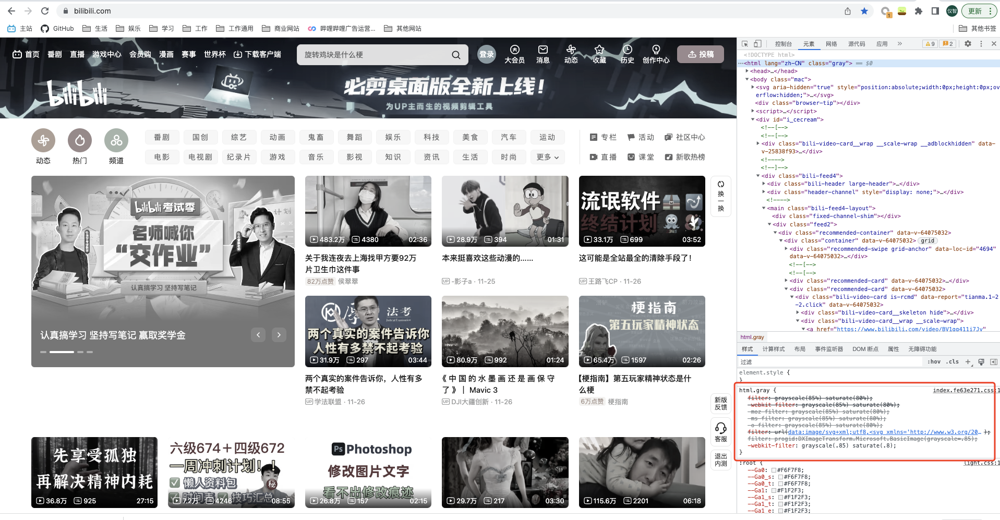
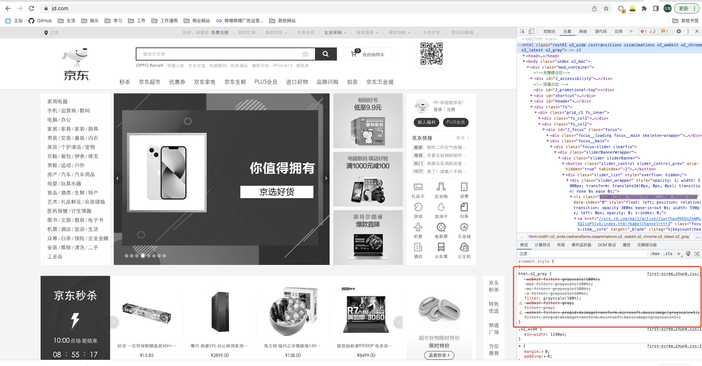
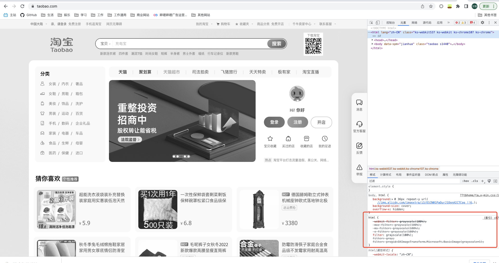

---
# try also 'default' to start simple
theme: seriph
record: dev
# random image from a curated Unsplash collection by Anthony
# like them? see https://unsplash.com/collections/94734566/slidev
background: /cover.gif
# apply any windi css classes to the current slide
class: 'text-center'
# https://sli.dev/custom/highlighters.html
highlighter: shiki
# show line numbers in code blocks
lineNumbers: false
# some information about the slides, markdown enabled
info: |
  ## Slidev Starter Template
  Presentation slides for developers.

  Learn more at [Sli.dev](https://sli.dev)
# persist drawings in exports and build
drawings:
  persist: false
# use UnoCSS
css: unocss
---
# 前端如何实现网页变灰功能？
## ——敬爱的江泽民同志永垂不朽
<div class="pt-12">
  <div>汇报人：南北233</div>
</div>
<!--The last comment block of each slide will be treated as slide notes. It will be visible and editable in Presenter Mode along with the slide. [Read more in the docs](https://sli.dev/guide/syntax.html#notes)-->

---
---
# 1.各大网站的实现方案
### 1.bilibili

---
layout: image-right
image: /bilibili.png
---
## bilibili实现代码
```css {all|2|2-6|7-9|10}
html.gray {
    filter: grayscale(85%) saturate(80%);
    -webkit-filter: grayscale(85%) saturate(80%);
    -moz-filter: grayscale(85%) saturate(80%);
    -ms-filter: grayscale(85%) saturate(80%);
    -o-filter: grayscale(85%) saturate(80%);
    filter: url("data:image/svg+xml;utf8,<svg xmlns='http://www.w3.org/2000/svg'>
    <filter id='grayscale'><feColorMatrix type='matrix' values='0.3333 0.3333 0.3333 0 0 0.3333 0.3333 0.3333 0 0 0.3333 0.3333 0.3333 0 0 0 0 0 1 0'/></filter></svg>#grayscale");
    filter: progid:DXImageTransform.Microsoft.BasicImage(grayscale=.85);
    -webkit-filter: grayscale(.85) saturate(.8);
}
```
---
---
# 1.各大网站的实现方案
### 2.京东
  
---
layout: image-right
image: /jd.png
---
## 京东实现代码
```css {all|6}
html.o2_gray {
    -webkit-filter: grayscale(100%);
    -moz-filter: grayscale(100%);
    -ms-filter: grayscale(100%);
    -o-filter: grayscale(100%);
    filter: grayscale(100%);
    -webkit-filter: gray;
    filter: gray;
    -webkit-filter: progid:dximagetransform.microsoft.basicimage(grayscale=1);
    filter: progid:dximagetransform.microsoft.basicimage(grayscale=1);
}
```
---
---
# 1.各大网站的实现方案
### 3.淘宝
  
---
layout: image-right
image: /taobao.png
---
## 淘宝实现代码
```css {all|6}
html {
    -webkit-filter: grayscale(100%);
    -moz-filter: grayscale(100%);
    -ms-filter: grayscale(100%);
    -o-filter: grayscale(100%);
    filter: grayscale(100%);
    filter: gray;
    filter: progid:DXImageTransform.Microsoft.BasicImage(grayscale=1);
}
```
---
---
# 2.实现原理
### CSS3 filter属性
下面是MDN对filter的解释：
<br/>

> CSS 属性 filter 将模糊或颜色偏移等图形效果应用于元素。滤镜通常用于调整图像、背景和边框的渲染。

简单来说，filter 属性就是用来给元素添加不同的滤镜。该属性中支持传入多种 Filter 函数，其中 grayscale() 函数就是用于置灰的关键。grayscale() 函数将改变输入图像灰度，该函数有一个参数，表示转换为灰度的比例。当值为 100% 时，完全转为灰度图像；当值为 0% 时图像无变化。值在 0% 到 100% 之间，则是效果的线性乘数。若未设置值，默认是 0。
```css
{
  -webkit-filter: grayscale(100%);
  -moz-filter: grayscale(100%);
  -ms-filter: grayscale(100%);
  -o-filter: grayscale(100%);
  filter: grayscale(100%);
  -webkit-filter: gray;
  filter: gray;
  -webkit-filter: progid:dximagetransform.microsoft.basicimage(grayscale=1);
  filter: progid:dximagetransform.microsoft.basicimage(grayscale=1);
}
```
---
---
# filter属性拓展
1. blur 模糊
2. brightness 亮度
3. contrast 对比度
4. opacity 不透明度
5. sepia 棕褐色
6. drop-shadow 阴影
7. saturate 饱和度
8. 混合使用
---
--- 
## 1.blur 模糊
<br/>

> 此函数接受一个 CSS 长度值来确定屏幕上有多少像素需要相互融合以生成模糊结果。传递的 CSS 长度值越大，应用到元素的模糊度就越高。如果不提供值，则使用默认值 0。
<br>
>注意：blur作用在有内容的父元素上，会将子元素都模糊化。如果不想要周边的阴影，可以在父元素上加overflow:hidden。

---
--- 
## 2.brightness 亮度
<br/>

> brightness() 函数可用于调整图像的亮度级别，使其看起来更亮或更暗。当值为 0% 时，会产生全黑图像。值为 100% 或 1 会使图像保持其原始亮度级别。大于或小于 100% 或 1 的值决定图像的暗度或亮度。

---
--- 
## 3.contrast 对比度
<br/>

> contrast() 函数用于调整图像的对比度，也就是调整图像最暗和最亮部分之间的亮度差异 。它接受百分比或小数值来确定图像的对比度级别——值为 0 会导致完全灰色的图像。高于 100% 和 1 的值会增加对比度，而低于 100% 的参数会降低图像的对比度。

---
--- 
## 4.opacity 不透明度
<br/>

> opacity() 函数将透明效果应用于图像。它接受百分比或小数值来决定应用于图像的透明度。0% 或 0 的不透明度将产生完全透明的元素。100% 不透明度将显示不透明。将不透明度设置在 0% 和 100% 之间将使元素或图像部分透明。

<br/>
那这个不透明度滤镜和CSS中的 opacity 属性有啥区别的？它们都用于控制元素的透明度。但是 filter 属性会启动硬件加速。浏览器会将计算任务卸载到图形处理单元 (GPU) — 一种旨在加速系统内图形渲染的专用处理器。这会提高浏览器的效率并释放 CPU 来执行其他任务。

---
--- 
## 5.sepia 棕褐色
<br/>

> sepia() 函数可以为图像添加柔和的褐色色调，使图像看起来更温暖、更复古。它类似于使用灰度滤镜，但色调为褐色。它接受 0 到 1 之间的小数值，或最大为 100% 的百分比值。值为 0 会使图像保持不变。值为 100% 或 1 会将图像完全变为棕褐色，而介于 0% 和 100% 之间的值会使图像的色调介于其原始颜色和完全棕褐色之间。

---
--- 
## 6.drop-shadow 阴影
<br/>

> drop-shadow() 函数用于增加图像的阴影，和 box-shadow 的作用类似，使图像看起来更加立体。
drop-shadow() 函数接受四个参数：
offset-x：长度值，指定元素和投影之间的水平距离。正值将阴影置于元素右侧，负值将阴影置于左侧。
<br>
offset-y：长度值，指定元素和投影之间的垂直距离。正值将阴影置于元素下方，负值将阴影置于其上方。
<br>
blur-radius: 阴影的模糊半径指定为 CSS 长度单位。值越大，阴影变得越模糊。如果未指定，则默认为 0，产生清晰且不模糊的阴影。不允许使用负值。
<br>
color：阴影的颜色。如果未指定，则默认为黑色。

---
--- 
## 7.saturate 饱和度
<br/>

> saturate() 函数用于改变元素中颜色的饱和度。饱和元素的颜色比较鲜艳；对于曝光不足的图像可以增加饱和度，反之亦然。饱和度可以用百分比表示，0% 表示完全不饱和，100% 表示与原图像一样。

---
--- 
## 8.混合使用
<br/>

> 上面介绍的滤镜都是单个使用的，其实 filter 属性支持设置多个滤镜，其语法如下：
<br>
filter: blur() | brightness() | contrast() | drop-shadow() | grayscale() | hue-rotate() | invert() | opacity() | saturate() | sepia() | url();
<br>
> CSS 会根据它们出现的顺序将它们应用于元素。

除此之外，filter 属性还接受以下两个值：
<br>
initial：filter 属性的默认值，会解析为 none。
<br>
inherit：从元素的直接父级计算的 filter 属性的值。
---

# 示例

<div>
<!-- ./components/BImage.vue -->
<BImage />
</div>
---
